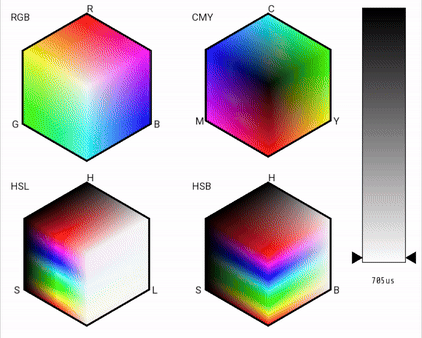

# Color-Hexagons

This project is a graphical application that demonstrates four different ways of representing colors: RGB, CMY, HSB, and HSL. The program features four hexagons, each visualizing one of these color representations. Transitions between these color representations are implemented, providing a dynamic visualization of how colors change across different models. This application was developed as a part of a computer graphics course in university.

## Features
- **Color Representations**: Displays colors using RGB, CMY, HSB, and HSL models.
- **Interactive Hexagons**: Click on any hexagon to display the coordinates of the color in that specific model, e.g., RGB(20, 100, 255).
- **Light Slider**: An adjustable slider that modifies the light parameter, affecting the color display in real-time.
- **Smooth Transitions**: Implements transitions between different color representations for a smooth visual experience.

## Technologies Used
- **C++**: The core programming language used for developing the application.
- **SFML**: The Simple and Fast Multimedia Library (SFML) used for graphics rendering and handling user input.

## Demo

## Usage
- **Run the Application**: Compile and run the application using your preferred C++ compiler with SFML support.
- **Interact with Hexagons**: Click on any of the four hexagons to display the color coordinates in the chosen model.
- **Adjust Light**: Use the slider to change the light parameter and observe the color changes in real-time.

